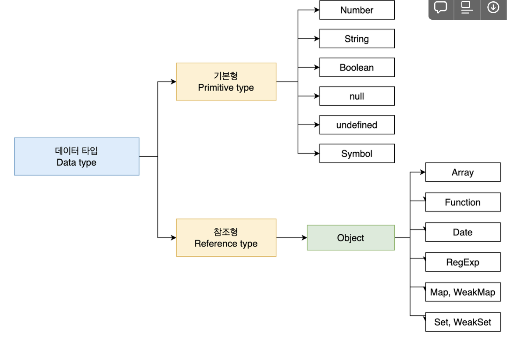
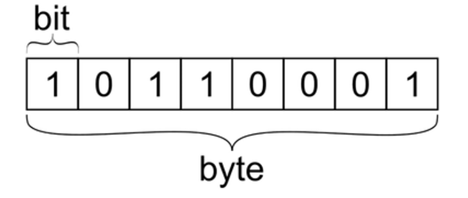

## 1. 데이터 타입 심화

### (1) 데이터 타입의 종류(기본형과 참조형)



[기본형과 참조형의 구분]

1. 복제의 방식
    1. 기본형 : 값이 담긴 주소값을 바로 복제
    2. 참조형 : 값이 담긴 주소값들로 이루어진 묶음을 가리키는 주소값을 복제
2. 불변성의 여부
    1. 기본형 : 불변성 O
    2. 참조형 : 불변성 X

### (2) 메모리와 데이터에 관한 배경지식

1. 메모리, 데이터
    1. 비트
        1. 컴퓨터가 이해할 수 있는 가장 작은 단위죠
        2. 0과 1을 가지고 있는 **메모리를 구성하기 위한 작은 조각**
        3. 조각들이 모여서 **메모리**가 만들어짐
    2. 바이트
        1. 0과 1만 표현하는 비트를 모두 찾기는 부담
        2. 1개 → 2개 → … → 8개(새로운 단위 : byte)
        3. 바이트는 항상 메모리 주소값을 갖고 있다.
        
        
        
    3. 메모리(memo + ry) : byte 단위로 구성
        1. 모든 데이터는 byte 단위의 식별자인 메모리 주소값을 통해서 서로 구분이 됩니다.
    4. java, c와 다른 javascript의 메모리 관리 방식(feat. 정수형)
        1. 8을 저장하는 방법
            1. JS : let a = 8(8byte)
            2. JAVA
                1. byte a = 8(1byte)
                2. short a = 8(2byte)
                3. int a = 8(4byte)
                4. long a = 8(16byte)
        2. java 또는 c언어가 초기에 등장했을 때 숫자 데이터 타입은 크기에 따라 다양하게 지정해줘야 했음
        3.  하지만 javascript는 메모리 이슈까지는 고민 X
2. 식별자, 변수
    1. var testValue = 3
    2. 변수 = 데이터 (3)
    3. 식별자 = 변수명 (testValue)

### (3) 변수 선언과 데이터 할당

1. 할당 예시(메모리에 할당되는 방식을 보려면 풀어 쓴 방식 선호)

```jsx
/** 선언과 할당을 풀어 쓴 방식 */
var str;
str = 'test!';

/** 선언과 할당을 붙여 쓴 방식 */
var str = 'test!';
```

윗 부분(주소, 데이터 )변수 영역 / 밑에는 데이터 영역

| 주소 | … | 1002 | 1003 | 1004 | 1005 | … |
| --- | --- | --- | --- | --- | --- | --- |
| 데이터 |  | 이름 : str
데이터 : @5004 |  |  |  |  |
| 주소 | … | 5002 | 5003 | 5004 | 5005 | … |
| 데이터 |  | 안 비어있음 | 안 비어있음 | ‘test!’ |  |  |
1. 값을 바로 변수에 대입하지 않는 이유(데이터: ‘test!’이렇게 안하는 이유)
    1. 자유로운 데이터 변환
        1. 이미 입력한 문자열이 길어진다면?
        2. 숫자는 항상 8byte로 고정, 문자는 고정 아님(영문 : 1byte, 한글 : 2byte). 
        3. ex. 이미 **1002 주소에 할당된 데이터**를 변환하려 할 때 훨씬 더 큰 데이터를 저장하려 한다면 → 1003 이후부터 저장되어있는 모든 데이터를 오른쪽으로 다 미뤄야함
    2. 메모리의 효율적 관리
        1.   똑같은 데이터를 여러번 저장해야 한다면?
        2. ex. 1만개의 변수를 생성해서 모든 변수에 숫자 1을 할당. 모든 변수를 별개로 인식 →  1만개의 변수 공간을 확보해야함
            1. 바로 대입하는 case) 숫자형은 8 바이트 고정이죠?
                1. 1만개 * 8byte = **8만 byte**
            2. 변수 영역에 별도 저장 case)
                1. 변수 영역 : 2바이트 1만개 = ****2만바이트 (변수 영역에 저장되는 데이터는 2바이트로 가정) 
                    
                    → 변수영역은 데이터 영역보다 바이트 크기가 작음
                    
                2. 데이터 영역 : 8바이트 1개 = 8바이트
                3. 총 : **2만 8바이트**

### (4) 기본형 데이터와 참조형 데이터

1. 메모리를 기준으로 다시한번 생각해보는 **두 가지 주요 개념**
    1. 변수 vs 상수
        1. 변수 : 변수 영역 메모리를 변경할 수 있음
        2. 상수 : 변수 영역 메모리를 변경할 수 없음
    2. 불변하다 vs 불변하지 않다
        1. 불변하다 : 데이터 영역 메모리를 변경할 수 없음
        2. 불변하지 않다 : 데이터 영역 메모리를 변경할 수 있음
2. 불변값과 불변성(with 기본형 데이터)
    
    ```jsx
    // a라는 변수가 abc에서 abcdef가 되는 과정을 통해 불변성을 유추해봅시다!
    
    // 'abc'라는 값이 데이터영역의 @5002라는 주소에 들어갔다고 가정할게요.
    var a = 'abc';
    
    // 'def'라는 값이 @5002라는 주소에 추가되는 것이 아니죠!
    // @5003에 별도로 'abcdef'라는 값이 생기고 a라는 변수는 @5002 -> @5003
    // 즉, "변수 a는 불변하다." 라고 할 수 있습니다.
    // 이 때, @5002는 더 이상 사용되지 않기 때문에 가비지컬렉터의 수거 대상이 됩니다.
    a = a + 'def';
    ```
    
3. 가변값과 가변성(with 참조형 데이터)
    1. 참조형 데이터의 변수 할당 과정
    
    ```jsx
    // 참조형 데이터는 별도 저장공간(obj1을 위한 별도 공간)이 필요합니다!
    var obj1 = {
    	a: 1,
    	b: 'bbb',
    };
    ```
    
    | 주소 | 1001 | 1002 | 1003 | 1004 |
    | --- | --- | --- | --- | --- |
    | 데이터 | obj1 /
    @7103~ |  |  |  |
    | 주소 | 5001 | 5002 | 5003 | 5004 |
    | 데이터 | 1 | ‘bbb’ | 2 |  |
    
    [obj1을 위한 별도 공간(참조형 데이터라서)]
    
    | 주소 | 7103 | 7104 | 7105 | 7106 |
    | --- | --- | --- | --- | --- |
    | 데이터 | a 
    @5001 → @5003 | b
    @5002 |  |  |
    
    b. 기본형 데이터의 변수 할당 과정과 차이점 : **객체의 변수(프로퍼티) 영역**의 별도 존재 여부
    
    c. 참조형 데이터가 불변하지 않다(가변하다)라고 하는 이유
    
    1. 데이터 영역에 저장된 값은 여전히 계속 불변값이지만, obj1을 위한 별도 영역은 얼마든지 변경이 가능. 이것 때문에 참조형 데이터를 흔히, `불변하지 않다(=가변하다)`라고 한다.
    
    d. 중첩 객체의 할당
    
    > 자바스크립트에서 중첩객체란, 객체 안에 또 다른 객체가 들어가는 것을 말해요. 이번 주차 초반에 살펴보았듯이 객체는 배열, 함수 등을 모두 포함하는 상위개념이기 때문에 **배열을 포함하는 객체도 중첩객체**라고 할 수 있답니다.
    > 
    
    ```jsx
    var obj = {
    	x: 3,
    	arr: [3, 4, 5],
    }
    
    // obj.arr[1]의 탐색과정은 어떻게 될까요? 작성하신 표에서 한번 찾아가보세요!
    ```
    
    | 주소 | 1001 | 1002 | 1003 | 1004 | 1005 | … |
    | --- | --- | --- | --- | --- | --- | --- |
    | 데이터 | obj /@7103~ |  |  |  |  |  |
    | 주소 | 5001 | 5002 | 5003 | 5004 | 5005 | … |
    | 데이터 | 3 | 4 | 5 |  |  |  |
    
    | 주소 | 7103 | 7104 | … |
    | --- | --- | --- | --- |
    | 데이터 | x/@5001 | arr/@8104~ |  |
    
    | 주소 | 8104 | 8105 | 8106 | … |
    | --- | --- | --- | --- | --- |
    |  | 0/@5001 | 1/@5002 | 2/@5003 |  |
    
    e. 참조 카운트가 0인 메모리 주소의 처리
    
    1. 참조카운트란 무엇일까요?
        
        <aside>
        💡 객체를 참조하는 변수나 다른 객체의 수를 나타내는 값입니다. 참조 카운트가 0인 객체는 더 이상 사용되지 않으므로, 가비지 컬렉터에 의해 메모리에서 제거됩니다.
        
        </aside>
        
    2. 가비지컬렉터(GC, Garbage Collector)
        
        <aside>
        💡 더 이상 사용되지 않는 객체를 자동으로 메모리에서 제거하는 역할을 합니다. 자바스크립트는 가비지 컬렉션을 수행함으로써 개발자가 명시적으로 메모리 관리를 하지 않아도 되도록 지원합니다. 자바스크립트 엔진에서 내부적으로 수행되며, 개발자는 가비지 컬렉션에 대한 직접적인 제어를 할 수 없습니다.
        
        </aside>
        
4. 변수 복사의 비교
```jsx
// STEP01. 쭉 선언을 먼저 해볼께요.
var a = 10; //기본형
var obj1 = { c: 10, d: 'ddd' }; //참조형

// STEP02. 복사를 수행해볼께요.
var b = a; //기본형 (a의 주소 복사)
var obj2 = obj1; //참조형 (obj1 주소 복사)

// STEP03. 복사 후 변경
b = 15;
obj2.c = 20;
```

| 주소 | 1001 | 1002   | 1003 | 1004 | 1005 | … |
| --- | --- | --- | --- | --- | --- | --- |
| 데이터 | a/@5001 | obj1/@7103~  | b/@5001 →  @5003 | obj2/@7103~ |  |  |
| 주소 | 5001 | 5002 | 5003 | 5004 | 5005 |  |
| 데이터 | 10 | ‘ddd’ | 15 | 20 |  |  |

| 주소 | 7103 | 7104 | … |
| --- | --- | --- | --- |
| 데이터 | c/@5001 → @5004 | d/@5002 |  |
1. [문제]

```jsx
// 기본형 변수 복사의 결과는 다른 값!
a !== b;

// 참조형 변수 복사의 결과는 같은 값!(원하지 않았던 결과😭)
obj1 === obj2;
```

1. 복사 이후 값 변경(객체 자체를 변경)
    
    → 객체의 프로퍼티(=속성)에 접근해서 값을 변경하는 것이 아니라 객체 자체를 변경하는 방식으로 
    
    ```jsx
    //기본형 데이터
    var a = 10;
    var b = a;
    
    //참조형 데이터
    var obj1 = { c: 10, d: 'ddd' };
    var obj2 = obj1;
    
    b = 15;
    **obj2 = {c: 20, d: 'aaa'};**
    ```
    
    | 주소 | 1001 | 1002 | 1003 | 1004 | 1005 | 1006 | … |
    | --- | --- | --- | --- | --- | --- | --- | --- |
    | 데이터 | a/@5001 | obj1/@7103~ | b/@5003 | obj2/@8104 |  |  |  |
    | 주소 | 5001 | 5002 | 5003 | 5004 | 5005 | 5006 | … |
    | 데이터 | 10 | ‘ddd’ | 15 | 20 | aaa |  |  |
    
    | 주소 | 7103 | 7104 | … |
    | --- | --- | --- | --- |
    | 데이터 | c/@5004 | d/@5002 |  |
    
    | 주소 | 8104 | 8105 | … |
    | --- | --- | --- | --- |
    | 데이터 | c/@5004 | d/@5005 |  |

### (5) 불변 객체

1. 불변 객체의 정의
    
    객체의 속성에 접근해서 값을 변경하면 ***가변이 성립*** 
    
    반면, 객체 데이터 자체를 변경(새로운 데이터를 할당)하고자 한다면 기존 데이터는 변경되지 않음 → ***불변하다***
    
2. 불변 객체의 필요성
    1. 객체의 가변성 문제점 예시
        
        ```jsx
        // user 객체를 생성
        var user = {
        	name: 'wonjang',
        	gender: 'male',
        };
        
        // 이름을 변경하는 함수, 'changeName'을 정의
        // 입력값 : 변경대상 user 객체, 변경하고자 하는 이름
        // 출력값 : 새로운 user 객체
        // 특징 : 객체의 프로퍼티(속성)에 접근해서 이름을 변경! -> 가변
        var changeName = function (user, newName) {
        	var newUser = user; //할당하는 방식으로 복사
        	newUser.name = newName;
        	return newUser;
        };
        
        // 변경한 user정보를 user2 변수에 할당
        // 가변이기 때문에 user1도 영향을 받음
        **var user2 = changeName(user, 'twojang');**
        
        // 결국 아래 로직은 skip
        if (user !== user2) {
        	console.log('유저 정보가 변경되었습니다.');
        }
        
        console.log(user.name, user2.name); // twojang twojang
        console.log(user === user2); // true
        ```
        
    2. 개선한 예시
        
        ```jsx
        // user 객체를 생성
        var user = {
        	name: 'wonjang',
        	gender: 'male',
        };
        
        // 이름을 변경하는 함수 정의
        // 입력값 : 변경대상 user 객체, 변경하고자 하는 이름
        // 출력값 : 새로운 user 객체
        // 특징 : 객체의 프로퍼티에 접근하는 것이 아니라, 아에 **새로운 객체를 반환** -> 불변
        var changeName = function (user, newName) {
        	return {
        		name: newName,
        		gender: user.gender,
        	};
        };
        
        // 변경한 user정보를 user2 변수에 할당
        // 불변이기 때문에 user1은 영향이 없음
        var user2 = changeName(user, 'twojang');
        
        // 결국 아래 로직이 수행
        if (user !== user2) {
        	console.log('유저 정보가 변경되었습니다.');
        }
        
        console.log(user.name, user2.name); // wonjang twojang
        console.log(user === user2); // false 👍
        ```
        
    3. 위 방법의 문제점
        - changeName 함수는 새로운 객체를 만들기 위해 변경할 필요가 없는 gender 프로퍼티를 하드코딩으로 입력
        - ⇒ 만일 이러한 속성이 10개라면? return에 10개 써줘야함
3. 더 나은 방법 : 얕은 복사
    1. 패턴과 적용
        
        ```jsx
        // 패턴
        var copyObject = function (target) {
        	var result = {};
        
        	// for ~ in 구문을 이용하여, 객체의 모든 프로퍼티에 접근
        	// 이 copyObject로 복사를 한 다음, 복사를 완료한 객체의 프로퍼티를 변경
        	for (var prop in target) {
        		result[prop] = target[prop];
        	}
        	return result;
        }
        ```
        
        ```jsx
        //위 패턴을 예제에 적용
        var user = {
        	name: 'wonjang',
        	gender: 'male',
        };
        
        var user2 = copyObject(user);
        user2.name = 'twojang';
        
        if (user !== user2) {
        	console.log('유저 정보가 변경되었습니다.');
        }
        
        console.log(user.name, user2.name);
        console.log(user === user2);
        ```
        
4. 얕은 복사 vs 깊은 복사
    
    → 여전한 문제:  **중첩된 객체**에 대해서는 **완벽한 복사를 할 수 없음**
    
    1. 얕은 복사 : 바로 **아래 단계의 값만** 복사(위의 예제)
    문제점 : 중첩된 객체의 경우 참조형 데이터가 저장된 프로퍼티를 복사할 때, 주소값만 복사
    2. 깊은 복사 : 내부의 모든 값들을 하나하나 다 찾아서 모두 복사하는 방법
    3. 중첩된 객체에 대한 얕은 복사 살펴보기
        
        ```jsx
        var user = {
        	name: 'wonjang',
        	urls: {
        		portfolio: 'http://github.com/abc',
        		blog: 'http://blog.com',
        		facebook: 'http://facebook.com/abc',
        	}
        };
        
        var user2 = copyObject(user);
        
        user2.name = 'twojang';
        
        // 바로 아래 단계에 대해서는 불변성을 유지하기 때문에 값이 달라짐
        console.log(user.name === user2.name); // false
        
        // 더 깊은 단계에 대해서는 불변성을 유지하지 못하기 때문에 값이 같음
        user.urls.portfolio = 'http://portfolio.com';
        console.log(user.urls.portfolio === user2.urls.portfolio); // true
        
        // 아래 예도 똑같
        user2.urls.blog = '';
        console.log(user.urls.blog === user2.urls.blog); // true
        ```
        
    4. **결국, user.urls 프로퍼티도 불변 객체로 만들어야 함**
    5. 중첩된 객체에 대한 깊은 복사 살펴보기
        
        ```jsx
        var user = {
        	name: 'wonjang',
        	urls: {
        		portfolio: 'http://github.com/abc',
        		blog: 'http://blog.com',
        		facebook: 'http://facebook.com/abc',
        	}
        };
        
        // 1차 copy
        var user2 = copyObject(user);
        
        // 2차 copy -> 이렇게까지 해줘야만 함
        user2.urls = copyObject(user.urls);
        
        user.urls.portfolio = 'http://portfolio.com';
        console.log(user.urls.portfolio === user2.urls.portfolio);
        
        user2.urls.blog = '';
        console.log(user.urls.blog === user2.urls.blog);
        ```
        
    6. 결론 : 객체의 프로퍼티 중, 기본형 데이터는 그대로 복사 + 참조형 데이터는 다시 그 내부의 프로퍼티를 복사 ⇒ **재귀적 수행!**
        
        <aside>
        💡 재귀적으로 수행한다?
        ⇒함수나 알고리즘이 자기 자신을 호출하여 반복적으로 실행되는 것 😎
        
        </aside>
        
    7. [결론]을 적용한 코드 —> 완벽히 다른 객체를 반환함
        
        ```jsx
        var copyObjectDeep = function(target) {
        	var result = {};
        	if (typeof target === 'object' && target !== null) {
        		for (var prop in target) {
        			result[prop] = copyObjectDeep(target[prop]);
        		}
        	} else {
        		result = target;
        	}
        	return result;
        }
        ```
        
         **‘깊은 복사’를 완벽하게** 구현
        
        ```jsx
        //결과 확인
        var obj = {
        	a: 1,
        	b: {
        		c: null,
        		d: [1, 2],
        	}
        };
        var obj2 = copyObjectDeep(obj);
        
        obj2.a = 3;
        obj2.b.c = 4;
        obj2.b.d[1] = 3;
        
        console.log(obj);
        console.log(obj2);
        ```
        

### (6) undefined와 null

1. undefined
    1. **값이 있어야 할 것 같은데 없는 경우**, 자동으로 부여
        1. 변수에 값이 지정되지 않은 경우, 데이터 영역의 메모리 주소를 지정하지 않은 식별자에 접근할 때
        2. .이나 []로 접근하려 할 때, 해당 데이터가 존재하지 않는 경우
        3. return 문이 없거나 호출되지 않는 함수의 실행 결과
    2. 2가지 역할을 가진 undefined
        1. 지금 undefined로 나오는 이 변수가, 필요에 의해 할당한건지 자바스크립트 엔진이 반환한건지 어떻게 앎? → 구분못함
        2. ‘없다’를 명시적으로 표현할 때는 undefined를 사용하지 말기
2. null
    1. 용도 : ‘없다’를 명시적으로 표현할 때
    2. 주의 : typeof null
        
        typeof null이 object인 것은 유명한 javascript 자체 버그
        
        ```jsx
        var n = null;
        console.log(typeof n); // object
        
        //동등연산자(equality operator)
        console.log(n == undefined); // true
        console.log(n == null); // true
        
        //일치연산자(identity operator) 일치연산자 쓰면 undefined와 null은 확실히 구분된다.
        console.log(n === undefined); // false
        console.log(n === null); // true
        ```